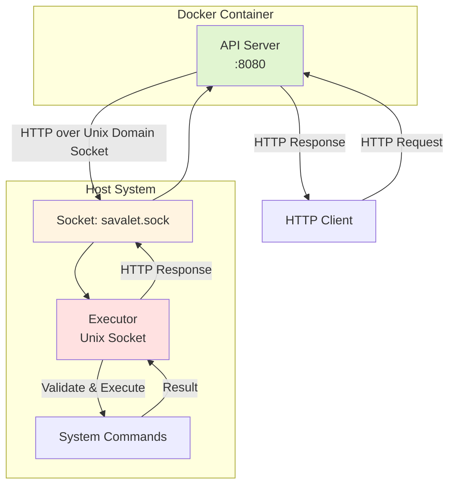

# Savalet

Savalet (Server valet) is a command execution service that exposes system commands through HTTP API, providing a alternative to SSH-based system integration.

## Motivation

SSH-based system integration, while simple to implement initially, often becomes a technical debt in the long term:

- SSH key management across multiple systems
- Difficult to monitor and audit command execution
- Complex error handling in distributed systems
- Tight coupling between systems

Savalet solves these problems by providing:

- **HTTP API interface**: Standard REST API for command execution
- **Container-friendly architecture**: API server can run in containers while maintaining host command access
- **Clear separation of concerns**: HTTP interface and command execution are isolated components

## Architecture

Savalet uses a two-tier architecture:



**Key Components:**

- **API Mode**: Runs in a Docker container without privileges, forwards HTTP requests to the executor
- **Executor Mode**: Runs on the host system, validates and executes commands
- **Unix Domain Socket**: Local communication channel between API and executor

This separation ensures that even if the API layer is compromised, attackers cannot directly execute commands on the host.

## Features

- **HTTP API for command execution**: RESTful interface for system integration
- **Container-compatible architecture**: Deploy API in containers while executing commands on host
- **Strict allow-list validation**: Only pre-configured commands and arguments can be executed
- **HTTP over Unix domain socket**: Standard, debuggable local communication between components
- **Structured JSON logging**: Comprehensive audit trail for all operations
- **Timeout enforcement**: Prevent runaway processes
- **Health check endpoints**: Integration with container orchestrators

## Prerequisites

- Go 1.24 or later (for building from source)
- systemd (optional, for service management; example unit files in `systemd/`)

## Configuration

- Executor Configuration (`example/executor.yaml`)
- API Configuration (`example/api.yaml`)

## Usage

### Running the Executor

```bash
$ savalet executor -config example/executor.yaml
```

### Running the API Server

```bash
$ savalet api -config example/api.yaml
```

### API Endpoints

Execute Command:

```bash
$ curl -X POST http://localhost:9090/execute \
    -d '{"command":"uptime","args":[],"timeout":10}'
```

Health Check:

```bash
$ curl http://localhost:9090/health
```

Readiness Check:

```bash
$ curl http://localhost:9090/ready
```

The executor itself can also be probed directly over the Unix domain socket, which is useful for diagnostics:

```bash
$ curl --unix-socket /var/run/savalet.sock http://executor/health
$ curl --unix-socket /var/run/savalet.sock http://executor/execute \
    -X POST -H "Content-Type: application/json" \
    -d '{"command":"uptime","args":[],"timeout":10}'
```

## Use Cases

- **CI/CD Integration**: Trigger deployments and service restarts via HTTP calls
- **Monitoring Systems**: Execute diagnostic commands from monitoring tools
- **Automation Platforms**: Integrate with workflow automation tools without SSH dependencies
- **Container Orchestration**: Manage host services from containerized control planes
- **Legacy System Integration**: Provide modern API access to traditional command-line tools

## Security Considerations

- **Command Allow-listing**: Only explicitly configured commands and arguments can be executed
- **Privilege Separation**: API server runs without privileges in a container, while the daemon runs on the host with minimal required privileges
- **No Command Enumeration**: The API does not expose available commands, reducing information disclosure
- **Unix Domain Socket**: Local-only communication between API and daemon with file permission controls
- **Audit Logging**: All command executions are logged with full details for compliance and troubleshooting

## License

This project is licensed under the [MIT License](./LICENSE).
